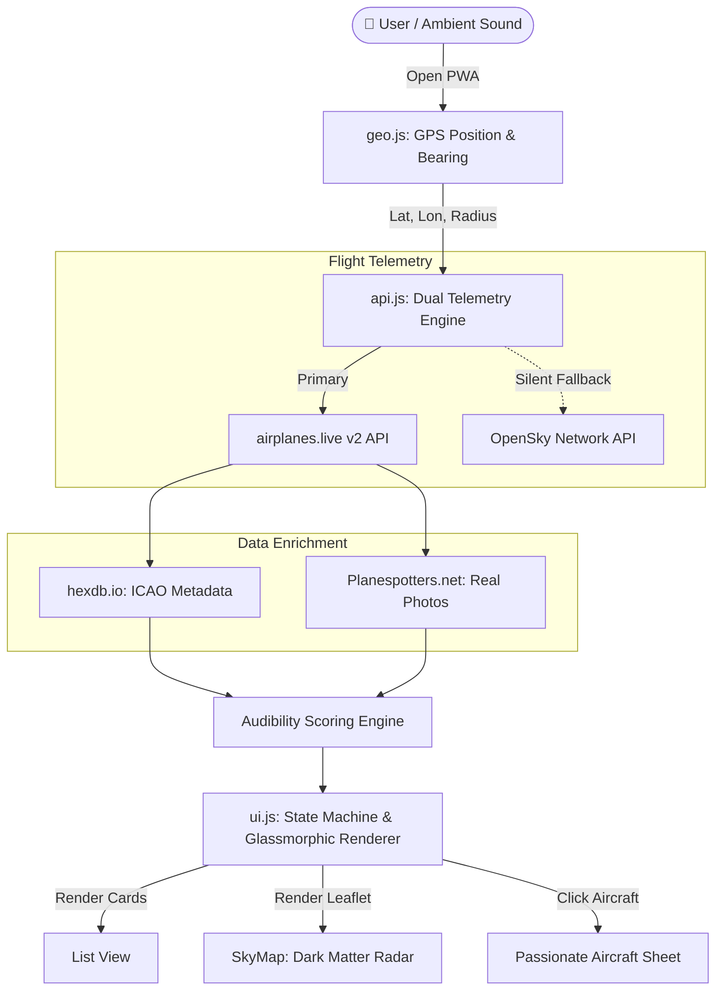

<div align="center">

  # ✦ Sylepse

  **Real-Time Ambient Aircraft Identification Operating System**

  *Hear a plane overhead → Open Sylepse → Zero-friction GPS geolocation → Real-time 3D airspace scan → Live aircraft model, photo, airline, altitude, and direction in under 3 seconds.*

  [](https://sylepse-v2-app.netlify.app)
  [](https://sylepse-v2-app.netlify.app)
  [](LICENSE)

  [**Live App 🚀**](https://sylepse-v2-app.netlify.app) • [**Features**](#-features) • [**Architecture**](#-architecture) • [**Getting Started**](#-getting-started)

</div>

---

## ⚡ Overview

**Sylepse** is an ultra-lightweight, zero-framework Progressive Web App (PWA) designed for instant, zero-tap aircraft identification. Built with a 2026 Raycast/Vercel-inspired dark design system, it captures ambient flight signals via ADS-B telemetry, enriches aircraft data with live high-resolution spotter photos, and projects flight paths on an integrated Leaflet Dark Matter radar.

> "Hear an aircraft sound IRL → Tap Home Screen icon → Instant identification before the sound fades."

---

## ✨ Features

- **⚡ Zero-Friction Scan**: Automatic high-accuracy GPS resolution (`navigator.geolocation`) upon opening.
- **🗺️ Native Dark Radar Map**: Custom Leaflet.js map with CartoDB Dark Matter tiles and real-time rotated SVG aircraft vectors.
- **📸 Live Aircraft Spotter Photos**: Real-time image fetching via Planespotters.net API for detected aircraft registrations.
- **📊 Audibility Scoring Engine**: Multi-variable altitude & distance proximity algorithm (`Très probable`, `Probable`, `Possible`, `Peu probable`).
- **📖 Aircraft Deep View Sheet**: Complete enthusiast breakdown including engine specs, max cruising speed, wingspan, and squawk code analysis.
- **🕒 Local Scan Persistence**: Offline-first scan history stored in `localStorage` with zero remote tracking.
- **⚙️ Dynamic Radial Controls**: On-the-fly adjustable scan radius (15 NM / 25 NM / 40 NM) and unit preferences (ft/m, km/NM).

---

## 🏗️ Architecture



---

## 🛠️ Tech Stack

| Layer | Technology |
|-------|------------|
| **Core Architecture** | Pure Vanilla JavaScript (ES6+ Modules, Zero Dependencies) |
| **Styling Engine** | Vanilla CSS3 (Custom Design Tokens, Glassmorphism, HSL tailwind-inspired palette) |
| **GIS & Maps** | Leaflet.js v1.9.4 + CartoDB Dark Matter Vector Tiles |
| **Telemetry APIs** | `api.airplanes.live` (Primary), `OpenSky Network` (Fallback) |
| **Enrichment APIs** | `hexdb.io` (ICAO Type Codes), `Planespotters.net` (Spotter Images) |
| **Deployment** | Netlify Global Edge CDN (PWA Service Worker Cached) |

---

## 📐 Audibility Scoring Algorithm

The audibility score determines how likely an aircraft is the source of the heard sound based on combining barometric altitude and ground distance:

$$\text{Audibility} = \begin{cases} 
\text{Très probable (🟢)} & \text{if } \text{Alt} < 1000\text{m} \land \text{Dist} < 8\text{km} \\ 
\text{Probable (🟡)} & \text{if } \text{Alt} < 3000\text{m} \land \text{Dist} < 15\text{km} \\ 
\text{Possible (🟠)} & \text{if } \text{Alt} < 6000\text{m} \land \text{Dist} < 25\text{km} \\ 
\text{Peu probable (⚪)} & \text{otherwise} 
\end{cases}$$

---

## 🚀 Getting Started

### Local Development

No build steps required. Simply serve the repository root with any HTTP server:

```bash
# Clone the repository
git clone https://github.com/TheoPerson/Sylepse.git
cd Sylepse

# Serve locally
npx serve -l 3000 .
```

Open `http://localhost:3000` in your browser.

---

## 📄 License

Designed & Developed by **Théo Person** ([@JUG_SEC](https://github.com/TheoPerson)). Licensed under the [MIT License](LICENSE).
